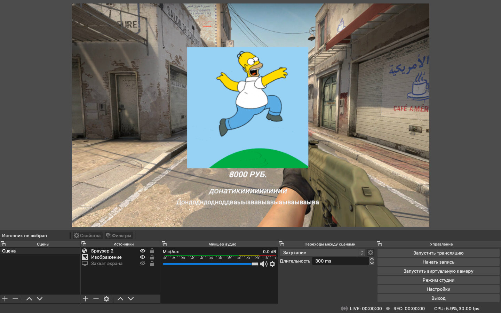

#Java
Проект представляет из себя аналог известного сервиса по приему донатов на стримах "DonationAlerts". Есть возможность вывода "средств", принятия "платежей". Есть возможность персонализировать уведомление о донате в зависимости от суммы. Есть возможность просмотра списка донатов, общей суммы, количества. Есть персональная страница приема "донатов" и уведомления о них, для того, чтобы встроить ее в стриминговую программу. Проект сделан лишь в целях обучения, а я в любом случае чего-то не знаю и какие-то моменты могут показаться странными, поэтому - критика приветствуется. Спасибо.

